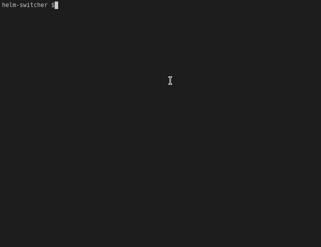

# helm-switcher

`helmswitch` is a CLI tool to install and switch between different versions of Helm 1, 2 or 3.  Once installed, just run the command and use the dropdown to choose the desired version of Helm.

Available for Linux and MacOS

## Why

Helm is the Kubernetes Package Manager, and Helm 2 will be deprecated at the end of 2020.  This tool is meant to help teams have an easier time transitioning between helm 2 and 3.

## Prerequisites 

- Go 1.14

## Installing from source

- `go build -o helmswitch`
- `./helmswitch`

Or just `go run main.go`

## How-to.
- `helmswitch` to open the menu and select the desired version, navigable with arrow keys
- `helmswitch {{ version_number }}` to download the desired version

